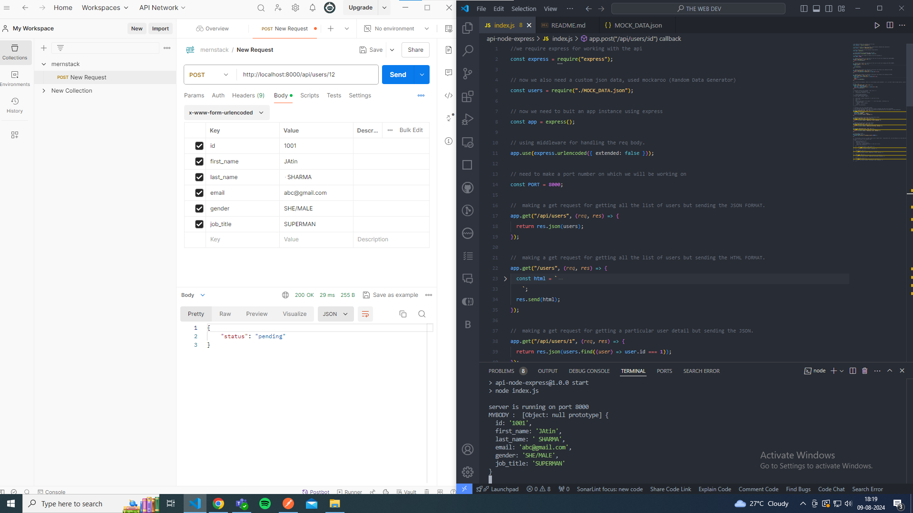
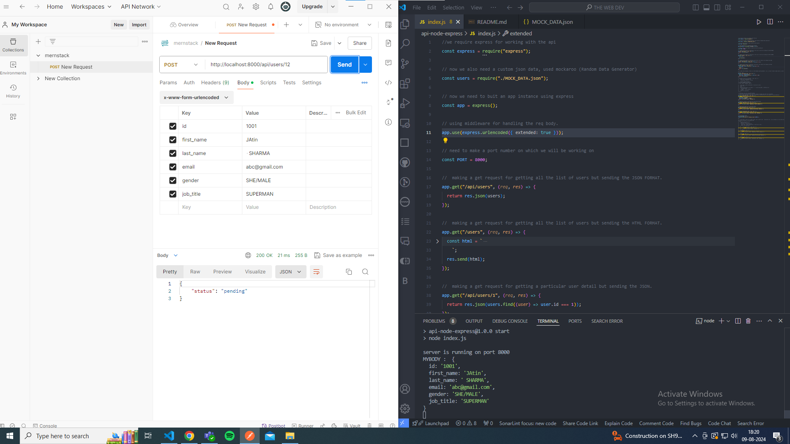
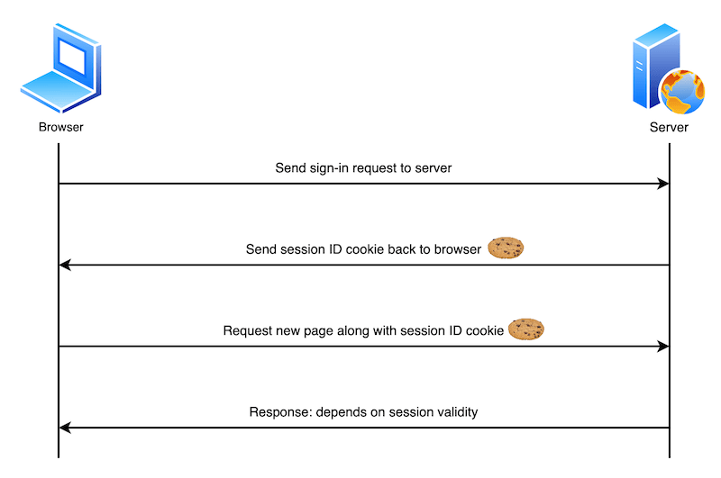

# REST API - JSON, Javascript Object (It can be another like text, image, HTML, etc )

- **GET** : Retrieve data from the server
  GET /api/users - give us list of all users // DONE
  GET /api/users/1 - give us user with id 1
  GET /api/users/:id - give us user with dynamic id, :id is the variable now.

- **POST** : Send data to the server to create a new resource
  POST /api/users - create a new user

- **PATCH** :
  When you want to update only specific attributes of a resource.
  PATCH /api/users/1 - update user with id 1
  Applies partial modifications to a resource. Only the fields provided in the request body are updated; other fields remain unchanged.
  Like if you only want to change the job status of user id 1

- **PUT** : Update an existing resource on the server
  When you want to update a resource completely.
  Replaces the entire resource at the given URI with the data provided in the request body.
  Like if you only want to change the entire detail of user id 1

  PUT is for completely replacing a resource.
  PATCH is for partially updating a resource.

- **DELETE** : Delete a resource from the server

REMEMBER :
best practices : always respect all http request ( GET, POST, Put, Patch and Delete )
Client-server Architecture : We should know who is the client ( brower, app, alexa, etc )

if request is : "/api/users/" ---> we are going to send a json
if request is : "/users/" ---> we are going to send a HTML

### Done with get request.

## Learning POST, PUT, PATCH, DELETE

Browser by default use Get request so we will learn POST, PATCH, PUT, DELETE separartely

We can't use browser for this as it use get method.
So we are going to use POSTMAN.

So in POST we are going to create a new user.
STEPS : ENTER THE DETAIL OF USERS LIKE ID, FIRSTNAME, LASTNAME, GENDER, JOB_TITLE... INSIDET THE x-www-form-urlencoded in the KEY-value pair

But the thing is after clicking the send button on the postman, i want the form data to be in the json file. or recieve in the broswer

so we are going to get that data in the body how?
 

<pre> const body = req.body;</pre>

<--- whatever we are sending is inside the body.
console.log(body) <--- undefined, even after sending the data from postman
because the express don't know what type of data is coming in the body and how to handle it. 
so to handle this issue, we use a middleware. How??  

<pre>app.use(express.urlencoded({extended:false}))
</pre>

### case1 : extended :false

### case2 : extended : true

now we got the data in the console that was passed in the postman.
now we need to send this data in the MOCK_DATA.json. HOW???  

## using fs module

<pre> const fs = require("fs");
</pre>
 

### Updating a field in existing user using PATCH method

<pre>
app.patch("/api/users/:id", (req, res) => {
  // TODO: Updating a field with id ( variable )
  const body = req.body;
  const id = +req.params.id;
  users.forEach((user, index) => {
    user.id === id ? (users[index] = { ...user, ...body }) : null;
  });
  fs.writeFile("MOCK_DATA.json", JSON.stringify(users), (err, data) => {
    return res.json({
      status: "successfully updated Email",
    });
  });
});
</pre>

### DONE WITH THE PATCH

## USING MIDDLEWARE

they are the functions that have access to the request and the response and the next middleware function in the application request-response cycle ( if there is multiple middleware between client and server)

they perform the following tasks :

- Execute any code
- Modify the request and response objects
- Call the next middleware function in the stack
- End the request-response cycle.

<pre>
Syntax:
app.use((req,res,next)=>{
// code to be executed
})
</pre>

CASE 1 :
if there is a middleware m1 and then it goes to method function.
but that middleware neither send any resposnse nor it pass the request further which means its holding the request.
(BAD PRACTICE)

<pre>
middleware 1 :
<b>app.use(express.urlextended({extended : false}))</b>
 
middleware 2 :
<b>app.use((req,res,next)=>{
// code to be executed
console.log("Hello from the MiddleWare 2");
})
</b>

// final function to be run
<b>app.get('/api/users',(req.res)=>{
return res.json(users)
})</b>
</pre>

OUTPUT : USER WON't get response and the postman will be on infinnite loading.

CASE2 : Returning the response from middleware so that they won't go further to the function method or the routes.
Reason behind : For authentication where we found something suspecious or wrong or feels like the request is made from a unauthorized user or a hacker.

<pre>
middleware 1 : 
<b>app.use(express.urlextended({extended : false}))
</b>

middleware 2 :
<b> app.use((req,res,next)=>{
// Code to be executed
console.log("Hello from the MiddleWare 2");
return res.json({STATUS : "NOT MOVING FURTHER - BY MIDDLEWARE"})
})
</b>
// final function to be run
//  This will not be called 
<b>
app.get('/api/users',(req.res)=>{
return res.json(users)
})
</b>
</pre>

### DONE WITH MIDDLEWARE

## HEADERS AND STATUS CODE

TO SET A HEADER IN REQ BODY, you need to do it mannually from the POSTMAN.
Or you can add in the req.body.(HEADER-NAME) = VALUE
 

 <pre>req.body["X-hero"] = true;</pre>

Custom header should be start with "X-" (SO THAT BROWSER OR THE POSTMAN CAN UNDERSTAND IT's CUSTOM BUILT HEADER)

But you can have access to any headers in any of the middlewares.
plus you can end the request/ hold it / send a response / edit the request

IF you are working on res headers, you can add one using

<pre>res.set('X-customHeaderName',value)</pre>

You can have access to any header in any of the middlewares.

## SOME GENERAL REQUEST HEADERS :

i. Content-Type

- Tells the server what kind of data you're sending.
- If you're sending JSON data, you use
- <pre> Content-Type: application/json</pre>>
- If you're sending form data, you'd use Content-Type: application/x-www-form-urlenpre>d.
- The server needs to know how to read and process the data you're sending.

ii. Accept

- Tells the server what kind of data you want back.
- If you want JSON data in response, you use
  <pre> Accept: application/json</pre>
- It helps the server know in what format to send the response back to you.

iii. User-Agent

- Identifies the app, browser, or device making the request.
- <pre> User-Agent: Mozilla/5.0 (Windows NT 10.0; Win64; x64)</pre>
- indicates that the request is coming from a specific version of the Mozilla Firefox browser on Windows.

iv. Accept-Language

- Tells the server your preferred language.
<pre>
- Accept-Language: en-US
</pre> 

v. Cookie

- Sends cookies (small pieces of data) stored in your browser to the server.
- Cookies are used to manage user sessions, store user preferences, and track user behavior on websites.
  
- Maximum size per cookie (usually 4KB).
- Set-Cookie: <cookie-name>=<cookie-value>
  TWO COOKIES IN SAME ID
- Set-Cookie: yummy_cookie=choco
- Set-Cookie: tasty_cookie=strawberry

(OR)

<pre> Cookie: yummy_cookie=choco; tasty_cookie=strawberry</pre>

<h3 style="font-size:1.5rem">Removal: defining the lifetime of a cookie<h3>

- You can specify an expiration date or time period after which the cookie should be deleted and no longer sent.

<pre>Set-Cookie: id=a3fWa; Expires=Thu, 31 Oct 2021 07:28:00 GMT;</pre>
 
<pre>Set-Cookie: id=a3fWa; Max-Age=2592000</pre>

Difference between Max-age and Expires

<table>
  <thead>
    <tr>
      <th>Attribute</th>
      <th>Max-Age vs Expires</th>
    </tr>
  </thead>
  <tbody>
    <tr>
      <td><strong>Definition</strong></td>
      <td>
        <ul>
          <li><strong>Expires:</strong> Specifies an exact date and time when the cookie should expire.</li>
          <li><strong>Max-Age:</strong> Specifies the number of seconds from the current time after which the cookie should expire.</li>
        </ul>
      </td>
    </tr>
    <tr>
      <td><strong>Example</strong></td>
      <td>
        <ul>
          <li><strong>Expires:</strong> <pre>Expires=Wed, 09 Aug 2024 10:00:00 GMT</pre></li>
          <li><strong>Max-Age:</strong> <pre>Max-Age=3600</pre> (expires in 1 hour)</li>
        </ul>
      </td>
    </tr>
    <tr>
      <td><strong>Advantages</strong></td>
      <td>
        <ul>
          <li><strong>Expires:</strong> Supported by older browsers; allows setting a specific expiration date.</li>
          <li><strong>Max-Age:</strong> Less error-prone; independent of the client's system clock; takes precedence if both are set.</li>
        </ul>
      </td>
    </tr>
    <tr>
      <td><strong>Disadvantages</strong></td>
      <td>
        <ul>
          <li><strong>Expires:</strong> Dependent on the client's system clock; potential errors if clocks are not synchronized.</li>
          <li><strong>Max-Age:</strong> Not supported by very old browsers.</li>
        </ul>
      </td>
    </tr>
  </tbody>
</table>
 
 <table>
  <thead>
    <tr>
      <th>Status Code Range</th>
      <th>Description</th>
    </tr>
  </thead>
  <tbody>
    <tr>
      <td>100 - 199</td>
      <td>Informational responses: These codes indicate that the request has been received and understood, and that the process is continuing.</td>
    </tr>
    <tr>
      <td>200 - 299</td>
      <td>Successful responses: These codes indicate that the request was successfully received, understood, and processed by the server.</td>
    </tr>
    <tr>
      <td>300 - 399</td>
      <td>Redirectional messages: These codes indicate that further action is needed to complete the request, usually involving a redirection to a different URL.</td>
    </tr>
    <tr>
      <td>400 - 499</td>
      <td>Client error responses: These codes indicate that there was an error with the request from the client side. For example, a wrong password or a non-existent URL.</td>
    </tr>
    <tr>
      <td>500 - 599</td>
      <td>Server error responses: These codes indicate that the server encountered an error while processing the request.</td>
    </tr>
  </tbody>
</table>

<h2>Examples of 400 Series Status Codes:</h2>
<ul>
  <li>400: Bad Request</li>
  <li>401: Unauthorized (User sign-in required)</li>
  <li>402: Payment Required (Under development)</li>
  <li>403: Forbidden (Server identified the user, but the user doesn't have permission to access the content)</li>
  <li>404: Not Found (Page not found)</li>
</ul>

### Done With Status codes

---
